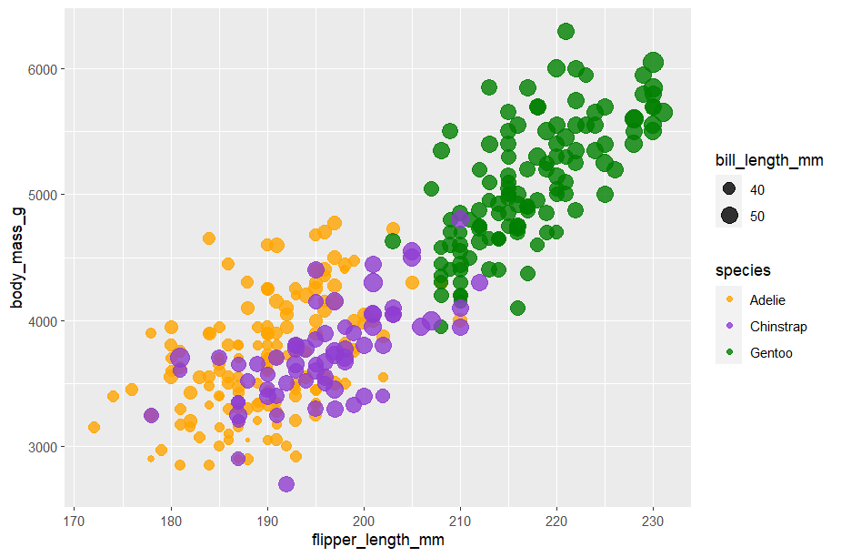
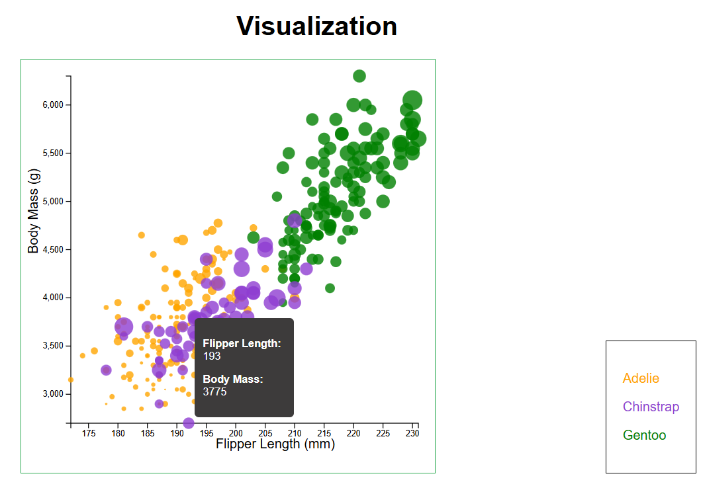
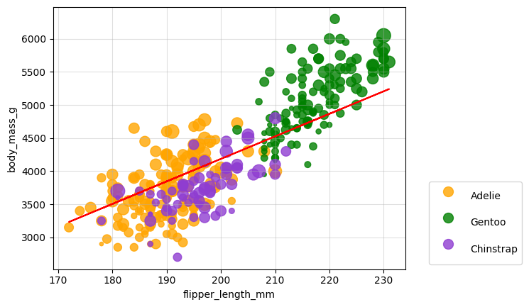
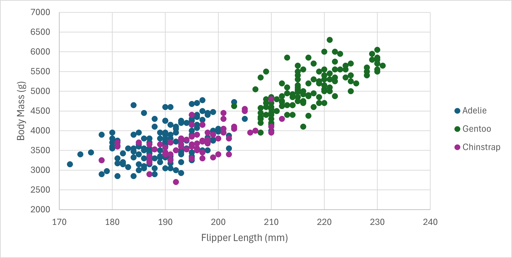

# 02-DataVis-5ways

PR Link: https://github.com/tacheampong/a2-DataVis-5ways

# R + ggplot2

The language used to create this visualization was R and the library used was the ggplot2. Initally I used the the plot() function from R to visualize the data and get better comfortability with the language. The plot() function required more lines of code to just implement adding different colors for dedicated species. ggplot2 is a an R library that aids in data visualization. I used various methods with the ggplot function, including; geom_point(), scale_color_manual(). Once I understood the syntax of ggplot2 it was any easy library to use with very little lines of code to accomplish the goal.

# Javascript + d3

The language used to create this visualization Javascript and the library was d3. With the help of assignment A1, the visualization of the scatterplot was quite helpful. Because my A1 assignment had scatterplot functionality I refactored to fit the use case of this assignment. The biggest challenge with working with d3 was understanding how to deal with loading the csv file and dealing with displaying data asychrounosly. To fix the issue of a pending Promise I first defined an async function to load the data using d3.csv(). Then I call the fetchData() method and attach a callback method to resolve the Promise using the 
.then() method. This allowed me to access the dataset (penglings.csv) before the promsise completed and could no longer access the dataset. Modifying the <circle>(S) to closely align with the example was a quite simple process that included editing the attributes of all circles.

 
# Python + matplotlib

The language used to create this visualization was Python and the library was matplotlib. I was quite familar with matplotlib because of coursework in data science. Getting started with the use the matplots scatter() method was a simple process. Though not a requirement of the assignment, implementing the legend was a simple process that required first looking through the matplotlib documentation to understand the paramters of the legend() method. The biggest challenge cample when trying to alter the size of the the points using the bill_length_mm parameter. Passing in the bill_length_mm values on its own caused incredibly large points that were overlapping. D3 and ggplts ability to size accordingly was lot more easier to figure compared to matplot. I decided to normalize the values to ensure that each point was comparable and could be noticably differnet from one another.

# Excel

The tool used to create this visualization was Excel. Excel is a great tool for creating automated data visualization from tables quickly. It was initally difficult to have the scatter plot created because the auto detected scatter plot for the penglings dataset had the incorrect values for the x and y values. Because of this, I had to manually change the range of the different series I wanted to display. Since i couldn't do groups directly from the whole dataset I had to create a dedicated series in Excel for each species type. Do this, allowed me to see differentiation of the species types. The legend creation was automatic also and only needed to be enabled in the tooltip of the visualization. A con of Excel compared to dedicated libraries in other languages is that personalization of charts is quite rigit and unflexible. The only way to change the colors of the species groups was through a dedicated pallete provided in the tooltip. Do to the fact that I could change the colors directly, I decided to choose the color pallete that had the most contrast between groups to make visualizng the chart easier. Through research of excel functionality the only way to change the size of data points was by manualling changing every single data point or setting a fixed size for a series. This is again a challenge with Excel. 

# Power BI

The tool used for this vizualization was Power BI. Power BI is another resource that enables automated data visualizations from datasets. Out of all tools/libraries this seemed to be the most inflexible in terms personalizstion of data visualizations. Loading data was met with various challenges especially when handeling NAN values and trying to "create a report" to use the visualization feature. Power BI didn't correctly indentify many of the decimal/whole number typed paramaters so they were interpreted as text. Turning the decimal/whole number paramters to their respective types caused errors within Power BI. To resolve these issues I used the "convert error values into X" feature (used null for X). The visualization style was very different from the expected output especially for the scale of the chart. Power BI didn't allow me to change the color of the species types and  when changing the size of the points to the bill_length_mm paramter it scaled them ackwardly. I would use this tool for very simple visualizations but any visual that is complex or high in personalization, I would choose one of the above libraries.    

## Technical Achievements
- **Regression Line**: Added a regression line of degree 1 to python + matplotlib to showcase how well a simple regressive line could predict body_mass based on flipper length
- **Tooltip**: Added tooltip to javascript + d3 visualization
### Design Achievements
- **Lengends**: Added legends to all visualization - the d3 visualization is from scratch 
- **Flex Box**: Added flex box styling to html of the javascript + d3 visual
- **Circle size**: Used normalization for mapping the size of the point to the bill_length in the python + matplotlib visual

